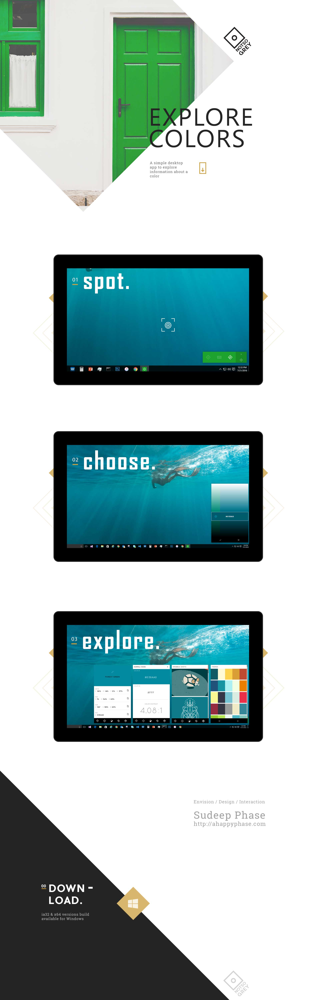

Note: This app is a small utility for people who live and dream colors. Under no circumstance, the code here is to be used commercially. 
This has been created just to explore and learn about different frameworks and how we can leverage them to build beautiful apps.
The color palettes and the images has been generated by crawling the sites such as Adobe Color and Dribbble. 

